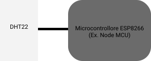
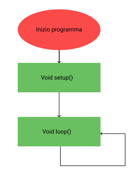
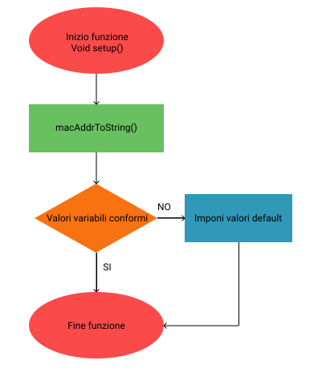
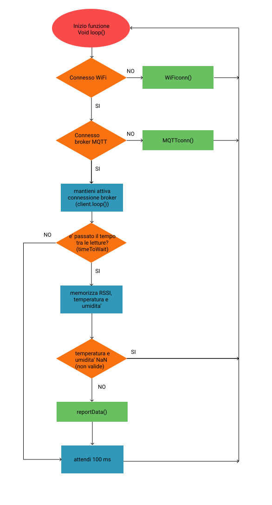

# DATACLIENT-DHT22


## Introduzione

Questo Sketch arduino si occupa di inviare i dati 
recuperati dal dht22 al raspberry via MQTT.

## Sezioni
* [Guida all'uso](#guida-alluso)
* [Descrizione](#descrizione)
* [Dettagli funzioni](#dettagli-funzioni)
* [Requisiti](#requisiti)
* [Changelog](#changelog)
* [Sviluppo](#sviluppo)

## Guida all'uso

Personalizzare, se necessario, il valore delle seguenti variabili:
* DHTPIN: pin dato del DHT22
  > NOTA: il numero pin nello sketch e il numero sulla scheda non corrispondono
* mqttServer: stringa contenente IP/dominio del broker MQTT
* mqttPort: porta in ascolto del broker MQTT
* mqttUser: utente broker MQTT
* mqttPassword: password di mqttUser
* timeToWait: tempo tra le letture
* WIFI_SSID: SSID access point WiFi
* WIFI_PASS: password access point WiFi

> I valori di default delle altre variabili sono adatti all'uso previsto
> nel progetto201 e la loro modifica puo' portare alla modifica di altri script.

Preparare il computer all'interfacciamento con Node MCU:
1. Installare il driver da [questa pagina](https://www.silabs.com/products/mcu/Pages/USBtoUARTBridgeVCPDrivers.aspx)
> Per altre schede installare il relativo driver

Preparare l'arduino IDE per caricare sketch su Node MCU:
1. Andare in ```File --> Impostazioni``` (CTRL + virgola)
2. In "URL aggiuntive per il Gestore schede" inserire l'URL
```
http://arduino.esp8266.com/stable/package_esp8266com_index.json
```
3. Chiudere e riaprire l'Arduino IDE per fargli scaricare le informazioni relative alle schede esp8266
4.  Andare in ```Strumenti --> Scheda: ... --> Gestore schede```
5. Cercare e installare ```esp8266 by ESP8266 Community```
6. Scegliere le impostazioni adatte a caricare sketch su NodeMCU:
  * Scheda: NodeMCU (o generic esp8266 module)
  * Flash Mode: QIO
  * Flash Frequency: 40 MHZ
  * CPU Frequency: 80 MHZ
  * Flash Size: 4M 1M SPIFFS
  * Reset Method: nodemcu
  * Upload Speed: 115200
> Per altre schede attenersi al procedimento consigliato dal produttore

Installare le librerie usate da questo sketch:
1. Andare in ```Sketch --> #Include libreria --> Gestione librerie```
2. Cercare e installare la libreria ```ArduinoJson by Benoit Blanchon``` per gestire oggetti JSON
3. Cercare e installare la libreria ```Adafruit Unified Sensor by Adafruit```, 
libreria necessaria per le altre librerie di sensori di Adafruit
4. Cercare e installare la libreria ```DHT sensor library by Adafruit``` per gestire il DHT22
5. Cercare e installare la libreria ```PubSubClient by Nick O'Leary``` 
per connettersi e inviare messaggi al broker MQTT

Selezionare da ```Strumenti``` la porta a cui e' connessa la scheda
e premere il pulsante ```Carica``` per caricare lo sketch.

## Descrizione



Come in tutti gli sketch arduino vengono definiti variabili e oggetti,
poi viene richiamata una volta la funzione ```setup()``` e infine viene
richiamata "all'infinito" la funzione ```loop()```



La funzione ```setup()``` richiama la funzione ```macAddrToString()```
per definire nella variabile stringa ```<macAddr>``` l'indirizzo MAC.
La funzione poi si assicura che ```<timeToWait>```, 
il tempo interposto tra le rilevazioni, 
sia un numero accettabile (>= 2000 [ms])
> Altrimenti viene impostato 2000 come valore di default (2 secondi tra lettura)



La funzione ```loop()``` mantiene la scheda connessa all'access point di raspberry
(con la funzione ```WiFiconn()```) e al broker MQTT (con la funzione ```MQTTconn()```
e il metodo ```client.loop()```).
Se la scheda e' connessa a WiFi e broker MQTT si verifica se e' stato atteso
il tempo ```<timeToWait>```: se e' così viene rilevata temperatura e umidita'
e memorizzato l'RSSI.

Lo sketch, dopo essersi assicurato che le rilevazioni hanno avuto successo,
utilizza la funzione ```reportData()``` per inviare i dati al broker MQTT.


Per la documentazione dettagliata del codice (creata da doxygen) 
visitare [questa pagina](doc/html/index.html)

### Dettagli funzioni

    macAddrToString()
Scorre l'array di byte restituito da ```WiFi.macAddress()```,
concatena come stringa i byte e la salva in ```<macAddr>```

    WiFiconn()
Si connette al WiFi e salva nella stringa ```<ipAddr>``` l'indirizzo IP 

    MQTTconn()
Si connette al broker MQTT e richiama la funzione ```present()```

    present()
Invia al broker MQTT indirizzi IP e MAC, tipo di nodo e ```<timeToWait>```
in formato JSON

    reportData()
Invia al broker MQTT i dati rilevati dal sensore e l'RSSI
in formato JSON

## Requisiti

* Arduino IDE con schede e librerie installate

## Changelog

**2020-02-18 01_01**:

Prima versione

## Sviluppo

Modificare il valore di queste due variabili:
* dhtConnected: impostare false se il DHT22 non e' connesso
  > NOTA: questa variabile in produzione DEVE essere impostata a true
  > per rilevare la temperatura dal DHT22. Puo' essere utile impostare
  > false durante fasi di test in cui non si ha necessita' del sensore.
* serialDebug: impostare true per visualizzare messaggi sul serial monitor
  > NOTA: questa variabile in produzione DOVREBBE essere impostata a false:
  > uno dei motivi e' la visualizzazione della password WiFi in 
  > caso di insuccesso durante la connessione

## Autore
Stefano Zenaro ([Github](https://github.com/mario33881))